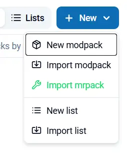
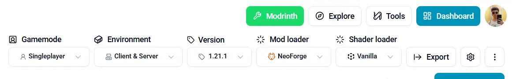
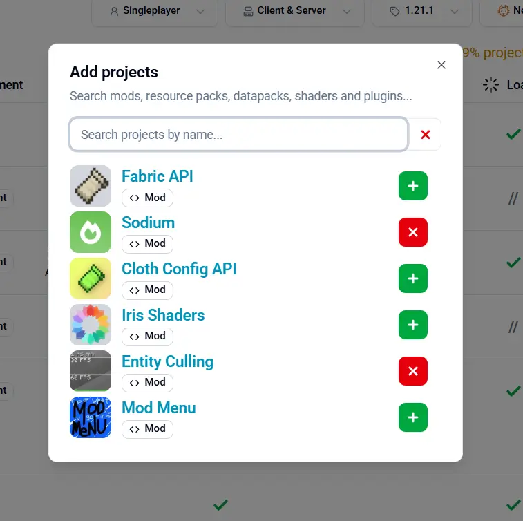
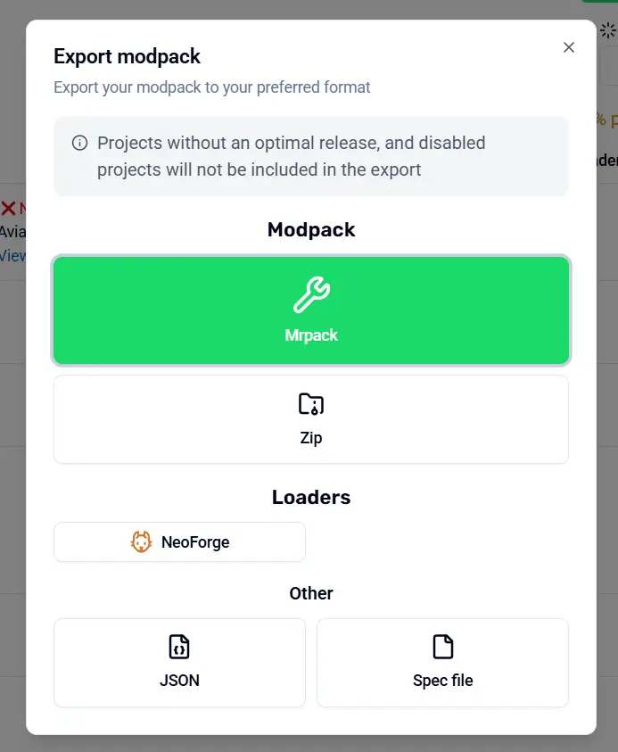

import { Steps } from '@astrojs/starlight/components';

<Steps>

1. Go to [Modpackker](https://modpackker.vercel.app/auth) and login with Google or GitHub

    

2. In the dashboard, click "New" and "New modpack"

    

3. In the top bar on the right, select [Gameplay](/gameplay), [Environment](/environment), [Version](/version), [Mod loader](/modloader) and [Shader loader](/shaderloader)

    

4. Click "Add projects" and add all the projects you want

    

5. Check if your projects are compatible using the editor

    

    :::note
    Incompatible projects will not be included in your modpack, you can remove them if you want, but keeping them in will make things easier when they'll get an update and become compatible. In this case toggle the switch on the right to disable them.
    :::

6. When you're satisfied with your modpack, click "Export", and chose the format

    

    :::note
    Your modpack is automatically saved in your account and displayed in your dashboard
    :::

</Steps>

:::note
Adding many [Mods](/mod) and [Datapacks](/datapack) to a [Modpack](/modpack) may create compatibility issues during [Gameplay](/gameplay).
Those problems can only be resolved by creating a [custom datapack](/craftdatapack).
:::

---

#### Related

- [Craft a datapack](/craftdatapack)
