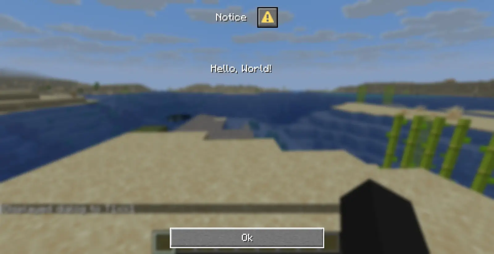

import { FileTree, Steps } from '@astrojs/starlight/components';

import Wiki from '~/components/wiki.astro';
import Yb from '~/components/yb.astro';

Dialogs are simple interfaces to show to the player using the [Dialog command](/commanddialog).

:::caution[Experimental]
Dialogs are still and experimental feature. To apply changes you would need to exit and re-open the world.
:::

<Steps>

1.  Create a folder named `dialog` in you [Datapack](/datapack) namespace

    {/* prettier-ignore */}
    <FileTree>
      - \<datapack\>
        - pack.mcmeta
        - pack.png
        - data
          - minecraft
            - ...
          - \<namespace\>
            - dialog
              - ...
    </FileTree>

2.  Create a `<dialog>.json` file for your dialog

    ```json
    // hello_world.json
    {
    	"type": "minecraft:notice", // The dialog type
    	"title": "Dialog", // The dialog title, shown at the top of the dialog
    	"body": [
    		// The dialog content, list of UI elements or only one element
    		{
    			"type": "plain_message",
    			"contents": "Hello world!"
    		}
    	]
    }
    ```

    All the dialog syntax is aviable on the <Wiki slug="Dialog" name="Dialog" />.

3.  Display your dialog with `/dialog show @s <datapack>:<dialog>`.

        

</Steps>

Here is a project showcasing the dialog system. [Dialog Teleport](https://modpackker.vercel.app/project/dialog-teleport).

#### [Dialog generator • Misode](https://misode.github.io/dialog)

---

#### Resources

<Yb id="wUpwt5V59JA" />
<Yb id="okWD6kFrYok" />
