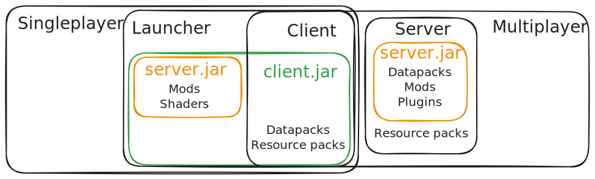

[Minecraft](/minecraft) [Environment](/environment) [Architecture](/architecture) has to taken into consideration for modded content.

In [Singleplayer](/singleplayer) your modpack has to include every mod, even the ones defined for server use.
The [Mod loader](/modloader) will handle which mods should access the [client.jar](/client) or the [server.jar](/server) parts of the architecture.

In multiplayer it's good practice to split your mods between client side and server side to reduce the bundle of your modpack with better performance.
Projects that need to access both the [client.jar](/client) and the [server.jar](/server) parts of the architecture have be included in both bundles.

