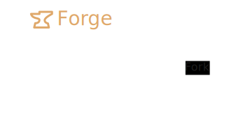

import Yb from '~/components/yb.astro';

Mod loaders are a type [Loader](/loader) that rewrites the [Minecraft](/minecraft) engine to add the possibility to entirely customize and add features to [Minecraft](/minecraft) with [Mods](/mod).
Mod loaders are essential for [Mods](/mod) as they expose functions and methods from their core to allow mods to control game features and interact with the [Vanilla](/vanilla) layer.

|                                              | Mod loader                                  | Status     |
| -------------------------------------------- | ------------------------------------------- | ---------- |
|              | [Fabric](/fabric)                           | Active     |
|               | [Forge](/forge)                             | Active     |
|            | [NeoForge](/neoforge)                       | Active     |
|               | [Quilt](/quilt)                             | Active     |
|              | [Babric](/babric)                           | Active     |
|                 | [BTA](/bta)                                 | Active     |
|        | [Legacy Fabric](/legacyfabric)              | Active     |
|           | [NilLoader](/nilloader)                     | Active     |
|             | [Ornithe](/ornithe)                         | Active     |
|          | [Liteloader](/liteloader)                   | Deprecated |
|                | [Rift](/rift)                               | Deprecated |
|  | [Risugami's modloader](/risugamismodloader) | Deprecated |

---

#### Resources

- [Reddit](https://www.reddit.com/r/feedthebeast/comments/1dcq5mx/how_do_minecraft_mod_loaders_work)

<Yb id="z7xHurMPuE0" />
<Yb id="3SCjLDEoZj8" />
<Yb id="d6a8XYIfnG0" />
<Yb id="f5GhsULsbfo" />
