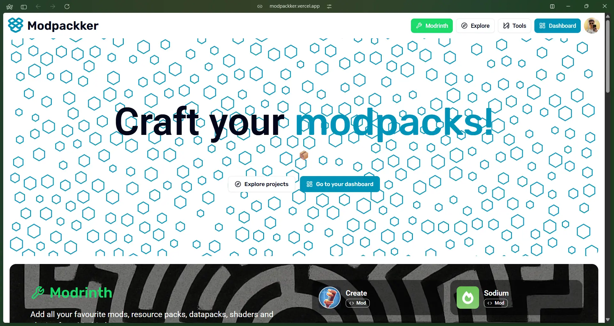
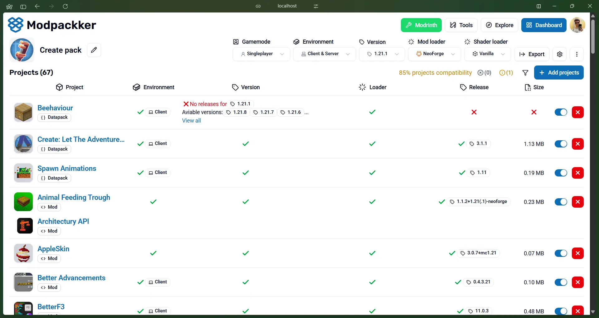

Modpackker is [Modpack](/modpack) editor webapp focused on project compatibility with [Minecraft](/minecraft) [Versions](/version), [Mod loaders](/modloader), [Plugin loaders](/pluginloader) and [Shader loaders](/shaderloader).

#### [Craft a modpack](/craftmodpack)
