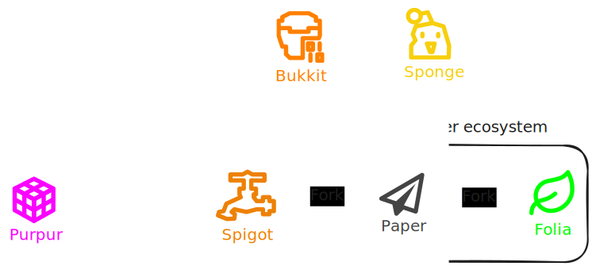

import Yb from '~/components/yb.astro';

Plugin loaders are a type of [Loader](/loader) that rewrite the [Minecraft](/minecraft) [server.jar](/server) to be able to add custom [Plugins](/plugin).

Plugin loaders and [Plugins](/plugin) are essential for servers with custom functionalities.

|                                  | Plugin loader     | Status     |
| -------------------------------- | ----------------- | ---------- |
|  | [Bukkit](/bukkit) | Deprecated |
|   | [Folia](/folia)   | Active     |
|   | [Paper](/paper)   | Active     |
|  | [Purpur](/purpur) | Active     |
|  | [Spigot](/spigot) | Active     |
|  | [Sponge](/sponge) | Active     |

#### [Server engines VS plugin loaders VS proxy servers](/serverenginevspluginloadervsproxyserver)

---

#### Resources

<Yb id="H2QZh527MaU" />

#### Related

- [Server engines](/serverengine)
- [Proxy server](/proxyserver)
