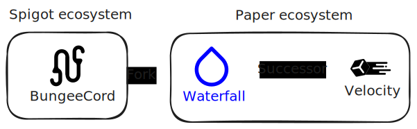

import Yb from '~/components/yb.astro';

A proxy server is a custom software designed to handle server networks and player traffic.

|                                      | Proxy server              | Status     |
| ------------------------------------ | ------------------------- | ---------- |
|  | [BungeeCord](/bungeecord) | Active     |
|      | [Geyser](/geyser)         | Active     |
|    | [Velocity](/velocity)     | Active     |
|   | [Waterfall](/waterfall)   | Deprecated |

#### [Server engines VS plugin loaders VS proxy servers](/serverenginevspluginloadervsproxyserver)

#### [Craft a server network](/craftservernetwork)

---

#### Resources

<Yb id="m1AGvJ9Bqv8" />

#### Related

- [Plugin loader](/pluginloader)
- [Transfer command](/commandtransfer)
