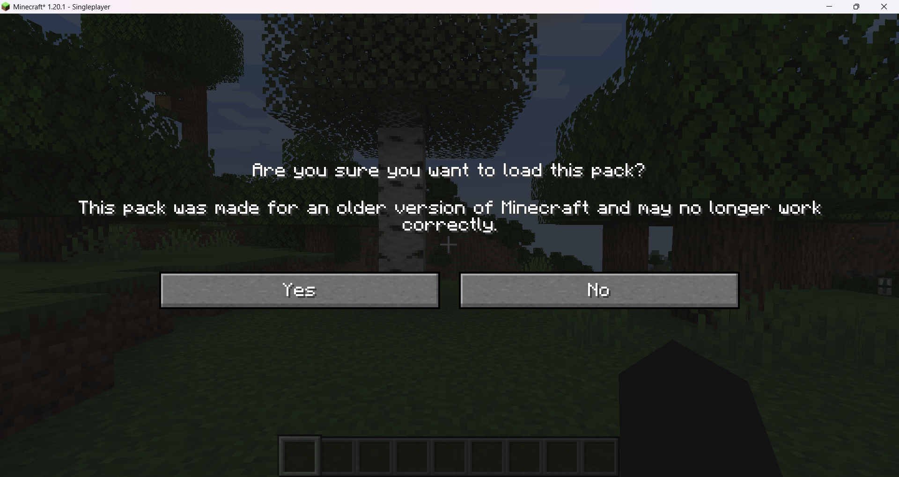

---
aliases:
  - Resource pack
  - Resource packs
  - Texture pack
  - Texture packs
title: Resource pack
---

Resource packs allow players to change the aspect of every texture in [Minecraft](/mcwiki/minecraft) without writing code also allowing for more complex cases like animations, randomness, and weighted targeted entity changes.

## Version
Resource packs are often designed to match specific Minecraft version. Minecraft updates may introduce new or change current blocks, textures, or mechanics that may not be compatible with older resource packs but it will only result in the non compatible things rendering the default textures instead and it will not cause any problems so it's safe to treat resource packs versions as an indicator to "works the best with" and not an actual requirement for the pack to work differently from [Mods](/mcwiki/mod) where the version is an actual requirement and Minecraft won't load and throw random errors.

:::note
Minecraft will warn you if you try to enable a resource pack with the wrong version

This alert cannot be turned using Minecraft settings and it can be overridden with [No Resource Pack Warnings • Modpackker](https://modrinth.com/mod/no-resource-pack-warnings)
:::

## [Server](/mcwiki/server) resource packs
It's possibile to load resource packs on a [Server](/mcwiki/server) so every player will have the same resource packs when they join without needing to install them on their [Client](/mcwiki/client).

:::danger[Important]
Despite being saved on the [Server](/mcwiki/server) these resource packs don't run on the server.  When a player joins the server and requests the world data from it, resource packs will get streamed to the player's [Client](/mcwiki/client) and only run on it.

Resource packs should only be tested for [Client](/mcwiki/client) [Environment](/mcwiki/environment)
:::

---

Resources
> [Resource pack – Minecraft Wiki](https://minecraft.fandom.com/wiki/Resource_pack)