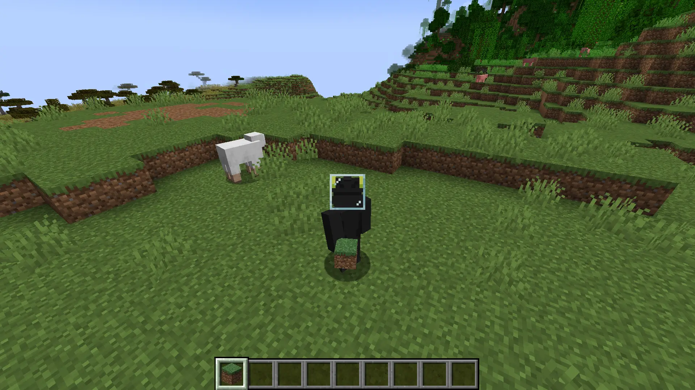
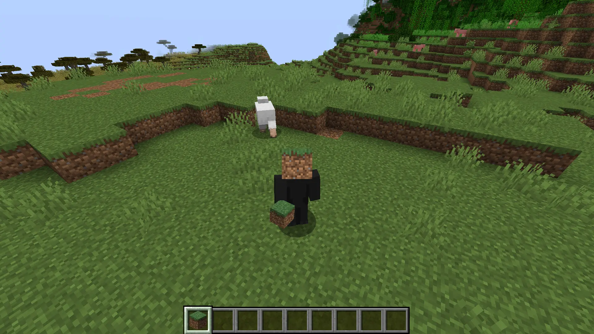
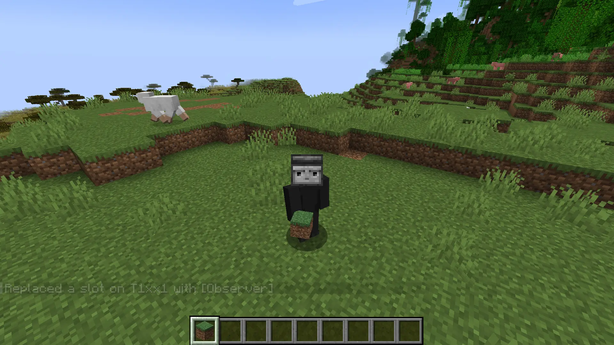
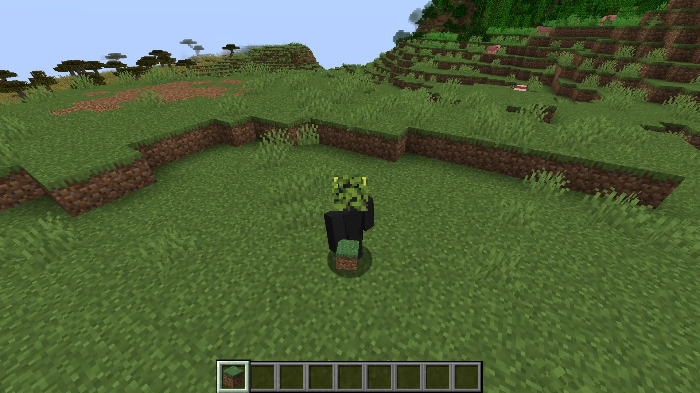

import Gallery from '~/components/gallery.astro';

Using [Commands](/command) you can wear any block.

```mcfunction
/item replace entity @s <armor> with <block> 1
```

Replace `<armor>` with `armor.head`, `armor.chest`, `armor.leggings` or `armor.boots` and `<block>` with the block [id](/identifier) you want to wear.

Example:

```mcfunction
/item replace entity @s armor.head with minecraft:glass 1
```



<Gallery>
    

    

    

</Gallery>

---

#### Related

- [Target selectors](/targetselector)
